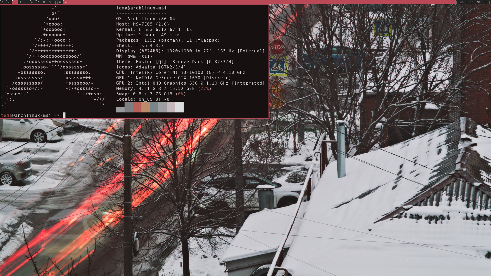
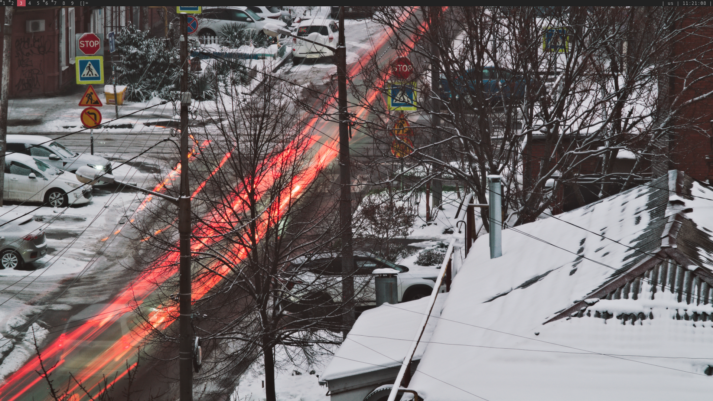

# My rice DWM
Это мой rice для оконного менеджера [DWM](https://dwm.suckless.org/).




## Особенности
*   Собранные патчи: нет
*   Цветовая схема: через wal 
*   Используемые утилиты: dmenu, st, clipmenu, flameshot

## Установка
```bash
# Клонируем репозиторий
git clone https://github.com/TemaSoul/rice_dwm.git
# Переходим в папку с dwm
cd rice_dwm/dwm
# Клонируем репозиторий# Копируем конфиги в домашний каталог (предварительно сделайте бэкап!)
cp -r . ~/.config/dwm/
cd ~/.config/dwm
# Собираем и устанавливаем
sudo make clean install


