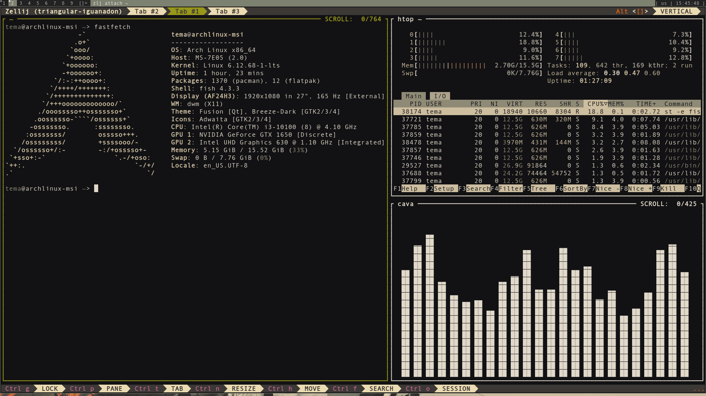
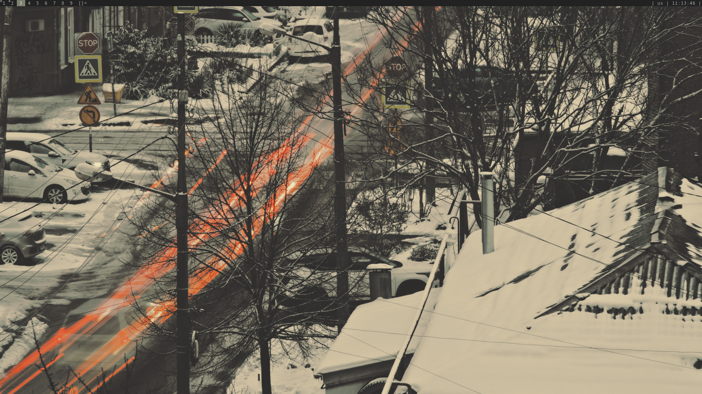

# my rice dwm
это мой rice для оконного менеджера [dwm](https://dwm.suckless.org/).




## особенности
*   собранные патчи: нет
*   цветовая схема: gruvbox
*   используемые утилиты: [dmenu](https://tools.suckless.org/dmenu/), [st](https://st.suckless.org/), [clipmenu](https://github.com/cdown/clipmenu), [flameshot](https://github.com/flameshot-org/flameshot), [feh](https://github.com/derf/feh), [zellij](https://github.com/zellij-org/zellij), [fish](https://github.com/fish-shell/fish-shell), [redshift](https://github.com/jonls/redshift)

## детали настройки
*   **автозапуск**: скрипт в `~/.config/dwm/autostart.sh` управляет запуском фоновых служб (redshift, flameshot, docker-контейнеры).
*   **статус-бар**: кастомный скрипт статус-бара (путь: `~/.config/dwm/statusbar.sh`) с выводом системной информации.

## зависимости
*   базовые инструменты сборки: `base-devel`
*   оконный менеджер и утилиты: `dmenu`, `st` (или собрать из папок репозитория)
*   дополнительные программы: `feh`, `flameshot`, `redshift`, `zellij`, `fish`, `clipmenu`

## установка
```bash
# 1. клонируем репозиторий и переходим в него
git clone https://github.com/temasoul/rice_dwm.git
cd rice_dwm

# 2. (рекомендуется) создаём бэкап существующей конфигурации dwm, если она есть
mv ~/.config/dwm ~/.config/dwm.backup 2>/dev/null || true
mv ~/.config/fish ~/.config/fish.backup 2>/dev/null || true
mv ~/.config/zellij ~/.config/zellij.backup 2>/dev/null || true
mv ~/.config/redshift ~/.config/redshift.backup 2>/dev/null || true

# 3. копируем наши конфиги
cp -r dwm fish zellij redshift ~/.config/

# 4. собираем и устанавливаем
cd ~/.config/dwm
sudo make clean install

